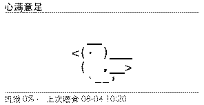
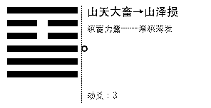
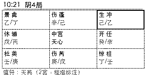
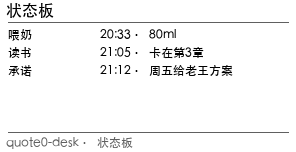
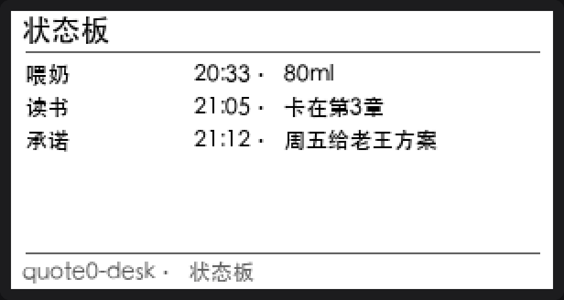
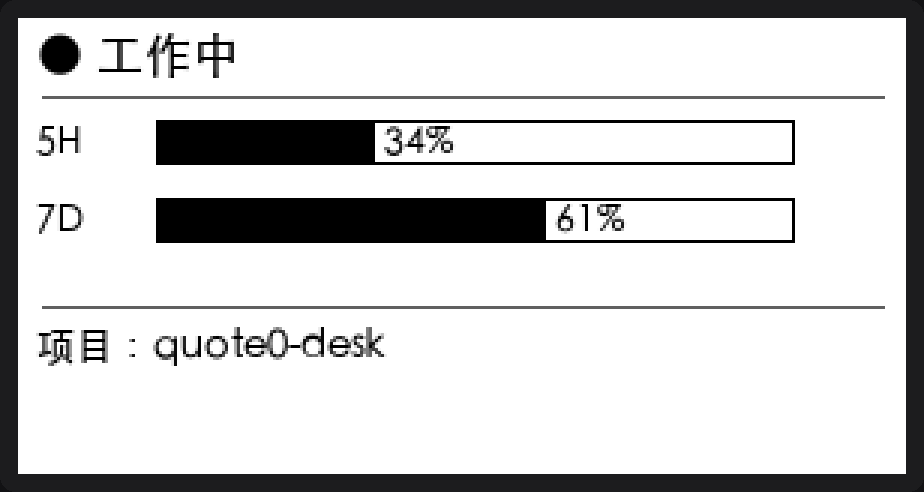
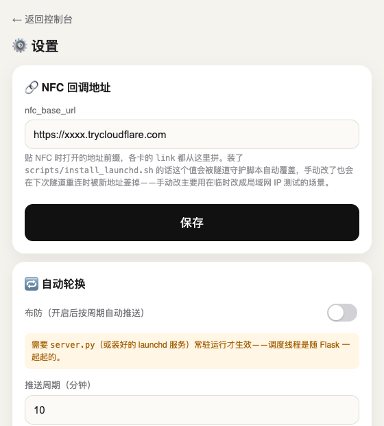

# quote0-desk

**把 [Quote/0](https://dot.mindreset.tech/developers) 墨水屏从单向显示面板改造成支持 NFC 交互的桌面装置。**

[](LICENSE)
[](requirements.txt)
[](scripts/install_launchd.sh)

一个跑在本地的 Python 服务，把自定义内容卡推到 Quote/0 墨水屏上：**屏上宠物**、**六爻摇卦**、**奇门遁甲**、**桌面箴言机**，以及跟 Claude 对话直接写屏的**状态板**和**应期复盘**。全部通过 NFC 双向交互——贴一下手机，服务器执行动作，新内容立即推回屏幕，不是"推上去就结束"的单向面板。

<p align="center">
     
</p>

---

MindReset 官方生态里已有 20 多个第三方项目（Home Assistant 集成、用量看板、MCP server 等），基本都是单向数据面板：内容推上去就结束了。这个项目的差异化是把设备自带的 NFC 也用了起来，构成一个完整闭环：贴一下手机 → 打开这张卡对应的回调地址 → 服务器执行一个动作（喂宠物、抽一签、打卡、翻下一句箴言）→ 新内容立即推回屏幕。

## 一天的使用场景

- **早上**：屏幕显示昨晚睡前推的日课干支，摸一下屏上宠物，NFC 触发它切到"精神"状态。
- **写代码时**：跟 Claude 说一句"记一下，这个 bug 是上游 API 返回顺序变了"，屏幕上多出一行带时间戳的记录——不用切窗口、不用打开手机。
- **专注块**：贴一下开始一个番茄钟，屏幕显示起止时刻，专注块进行中不会被自动轮换打断。
- **拿不准的决定**：跟 Claude 说"帮我起一卦，问这个方案要不要推翻重做"，几天后 Quote/0 会自己提醒你回来看"应了吗"，不需要主动想起来去问。
- **下班路上**：贴一下签筒，随机抽一次摇卦或奇门遁甲，纯粹是个不需要理由的小仪式。

这几个场景背后是两条不同的输入路径：**NFC 贴一下**（面向已经站在设备前的即时触发）和**跟 Claude 对话**（面向"这句话此刻在脑子里，屏幕应该记住它"，见下方 [MCP](#mcp让-claude-直接操作-quote0) 一节）。

## 特性

- **NFC 闭环**：贴一下手机，服务器执行动作，新内容立刻推回屏幕，不是"扫码看详情"式的单向跳转。
- **网页控制台**：`http://localhost:5252` 提供设备状态、每张卡的预览/推送、自动轮换开关，不需要记命令行参数。
- **16 张内容卡**：屏上宠物、六爻摇卦、奇门遁甲、签筒、日课、桌面箴言机、今日打卡、番茄钟、状态板、应期复盘、时间胶囊、实盘信标、Hermes 任务台、Hermes 消息、Claude Code 用量状态灯、换壁纸（自己上传图片）。
- **宠物状态对齐官方语义**：ASCII 造型和状态机移植自 Anthropic 官方 [claude-desktop-buddy](https://github.com/anthropics/claude-desktop-buddy)，接入 [buddy-bridge](#可选集成buddy-bridge) 后由真实的 Claude Code 会话信号驱动。
- **后台常驻，隧道自愈**：`server.py` 和 NFC 公网隧道注册为 macOS LaunchAgent，进程异常退出自动重启，隧道地址变化自动写回配置。
- **MCP 工具**：`draw_hexagram()`、`pat_pet()`、`set_today_task(...)` 等具体卡片工具，而非通用文本/图片透传接口。
- **仅使用官方 REST API**：不刷机、不越权、不碰固件，全部功能基于 Text API + Image API 两条推送路径实现。

## 效果预览

<p align="center">
  
</p>

左图为宠物默认状态，右图为手机贴一下 `/t/pet_pat` 后立即推回屏幕的结果。两张图均为 `render/pet.py` 本地生成，与实际推送到设备的是同一份图像。NFC 触发屏幕变化的真机验证记录见 [`docs/DEVICE-FACTS.md`](docs/DEVICE-FACTS.md) 的 M2 一节。

<p align="center">
  
  
</p>
<p align="center">
  
  
</p>

宠物卡的六个状态对应真实语义，而非任意选取的表情：

<p align="center">
  
</p>

跟 Claude 说一句话，屏幕上就会多一行记录或一次提醒，不需要打开手机或贴 NFC：

<p align="center">
  
  
</p>
<p align="center">
  
  
</p>

Claude Code 状态灯用横向进度条展示配额用量，不是纯文字堆数字（图中百分比为演示数据）：

<p align="center">
  
</p>

## 快速开始

```bash
pip install -r requirements.txt

export DOT_API_KEY=dot_xxx...     # Dot App → More → API Key 创建
# export DOT_DEVICE_ID=xxxxxxxx   # 可选：账号下只有一台设备时自动发现，无需填写

python3 cli.py hello               # 推一张最简卡，验证链路
python3 cli.py status              # 查看设备在线状态
python3 cli.py snapshot out.png    # 下载当前屏幕的真实渲染图，开发期主要的自查手段
python3 cli.py push <card_name>    # 推送 cards/ 下的某张卡，例如 python3 cli.py push pet
python3 cli.py set-todo "今天要做的事"
```

**前提条件**：需先在 Dot App「内容工坊」中添加 **文本 API** 和 **图片 API** 两个内容槽，并挂到设备循环任务中。添加后无需手动配置对应的 key——`GET /loop/list` 会按 `type` 字段自动发现。

> **槽位限制**：Quote/0 账号的 loop 槽位有硬上限（3 个）。若保留 1 个给官方内容（天气/新闻），实际可用的只有 **Text API** + **Image API** 两个槽。这不限制卡的数量（调度器负责轮流推送），限制的是同一时刻屏幕能展示的内容类型。完整实测记录见 [`docs/DEVICE-FACTS.md`](docs/DEVICE-FACTS.md)。

## 本地控制台

`python3 server.py` 启动后，打开 `http://localhost:5252` 即为网页控制台：设备在线状态、当前屏幕实际显示内容、每张卡的"预览"（执行一次 `build()` 但不推送）与"推送"按钮、自动轮换的布防状态均在此页面。16 张内容卡按用途分组显示（互动卡片 / 记录与提醒 / 信息展示 / Hermes 集成 / 自定义），每张卡带一句功能说明，不是一份不作区分的平铺列表。`/settings` 为配置页，用于修改 NFC 回调地址、开关自动轮换、勾选参与轮换的卡，无需手动编辑 `config.json` 或拼接 `curl` 命令。

<p align="center">
  
  
</p>

控制台 UI 结构参照同作者姊妹项目 [pocket-prophet-dashboard](https://github.com/BruceLanLan/pocket-prophet-dashboard)：`templates/*.html` + 一层 `/api/*` JSON 接口，基于 Flask 自带的 Jinja2，未引入额外依赖。手机与本机处于同一局域网时，手机浏览器打开 `http://<本机局域网 IP>:5252` 同样可用。

## 配置 NFC 交互

```bash
python3 server.py   # Flask，默认监听 0.0.0.0:5252
```

每次推送时，`link` 字段会被设为服务自身的地址；手机贴一下 NFC 即打开该 URL，触发对应路由执行动作，随后立即将新内容推回屏幕。该地址由单一配置项控制：

```bash
export NFC_BASE_URL=http://192.168.1.23:5252   # 手机与本机处于同一局域网时
```

未设置时卡片不带 `link`（能正常显示，仅贴一下无反应）。若局域网 IP 会变化、或手机与本机不在同一网络，可使用免注册的公网隧道：

```bash
brew install cloudflared
cloudflared tunnel --url http://localhost:5252
# 输出中会有一行 https://xxxx.trycloudflare.com，将其设为 NFC_BASE_URL
export NFC_BASE_URL=https://xxxx.trycloudflare.com
```

`nfc_base_url` 也可直接写入 `config.json`（已在 `.gitignore` 中，不会进入版本库），无需每次新开终端都重新 `export`。

### 长期运行：开机自动拉起

手动流程的问题是终端关闭或系统重启后，`server.py` 与 `cloudflared` 都会退出，NFC 随之失效。`scripts/install_launchd.sh` 将两者注册为 macOS LaunchAgent：开机/登录自动拉起，进程异常退出由 `launchctl` 自动重启；`scripts/tunnel_daemon.sh` 在每次拉起新隧道时自动解析 cloudflared 输出的新地址并写回 `config.json` 的 `nfc_base_url`，无需手动更新。

```bash
cp .env.example .env
# 编辑 .env，填入真实的 DOT_API_KEY（.env 已在 .gitignore 中；
# 密钥不写入 launchd 的 plist，因为那是明文 XML）

bash scripts/install_launchd.sh   # 安装两个 LaunchAgent 并立即拉起
```

安装脚本会打印日志路径；`data/tunnel_daemon.log` 记录当前生效的隧道地址。卸载：

```bash
bash scripts/uninstall_launchd.sh
```

该方案无需注册 Cloudflare 账号，代价是隧道地址每次重启会变化——地址变化会自动写回配置，无需人工干预，这是相对"固定域名 named tunnel"（需要账号，地址永久不变）方案的取舍。

### NFC 路由一览

| 路由 | 触发效果 |
|---|---|
| `/t/todo_toggle` | 今日一件事打卡，切换完成状态 |
| `/t/proverb_next` | 箴言机换下一句 |
| `/t/qiantong` | 签筒抽一签（摇卦或奇门二选一，真随机） |
| `/t/pet_pat` | 摸摸屏上宠物，触发一次性"精神"反应 |
| `/t/pomodoro` | 番茄钟：空闲时开始一个专注块，进行中时提前结束 |
| `/t/oracle_verdict` | 应期复盘：贴一下记为"应验了" |
| `/t/ping` | 诊断用，仅记日志不推送 |

### 排障：贴了没反应

按发生概率排序的已知原因：

1. **手机开着 VPN。** 目前唯一确认的"NFC 跳转到 Dot App 内部预览、未转发到本服务网页"的原因——App 内部会弹出一个不可交互的小窗口。关闭手机侧 VPN 可立即恢复正常。
2. **`NFC_BASE_URL` 已过期。** 局域网 IP 变化、隧道进程重启都会导致地址变化，而 `config.json` 里存的仍是旧值。需要重新 `export` 或调用 `config.update()`。
3. **手机与本机不在同一局域网。** 使用公网隧道方案（见上）。
4. **卡片的 `link` 为空。** 检查对应 `cards/*.py` 的 `build()` 是否调用了 `config.nfc_base_url()` 拼接地址——并非所有卡都需要 NFC 交互（状态灯、时间胶囊、信标本身就没有 `/t/...` 路由，`link` 为空是预期行为）。

## 全部内容卡

| 卡 | 命令 | 说明 |
|---|---|---|
| 箴言机 | `push proverb` | 从种子缓存中挑选一句，NFC 可换下一句；不接模型实时生成，避免"刷一次屏调一次模型" |
| 日课 | `push daily` | 当前时刻的四柱干支（年月日时）+ 日干五行，复用奇门遁甲卡的排盘引擎 |
| 摇卦 | `push liuyao` | `secrets` 真随机抛铜钱起卦 |
| 奇门遁甲 | `push qimen` | 九宫格排盘 |
| 签筒 | `push qiantong` | 摇卦/奇门二选一，NFC 触发版 |
| Claude Code 状态灯 | `push status` | 5h/7d 配额横向进度条，配额拿不到时退回"今日 tokens/成本"数字（不画假进度条）；多 profile 自动发现，细节见 [`render/status.py`](render/status.py) 头部注释 |
| 屏上宠物 | `push pet` | ASCII 造型和状态语义移植自官方 [anthropics/claude-desktop-buddy](https://github.com/anthropics/claude-desktop-buddy)（MIT）：sleep/idle/busy/attention/celebrate/heart，信号优先用 buddy-bridge 的实时 running/waiting，不可用时退回扫 commit 时间；NFC 贴一下触发摸摸（heart）；`waiting` 持续超过 5 分钟会从"有个操作在等你批准"升级为点名具体工具（需要 buddy-bridge） |
| 今日一件事 | `push todo` / `set-todo "..."` | 单条每日承诺，NFC 打卡 |
| 番茄钟 | `push pomodoro` | 贴一下开始一个专注块（屏幕显示起止时刻，不走秒），进行中不会被自动轮换覆盖，到点自动推送通知，不依赖自动轮换是否开启 |
| 状态板 | `push agent_board` | 跟 Claude 说一句话（例如"帮我记一下，答应老王周五给方案"），屏幕上新增一行带时间戳的记录，最多同时显示 5 行；仅支持对话式写入，不主动抓取任何数据 |
| 应期复盘 | `push oracle_review` | 跟 Claude 说一个问题起一卦（例如"帮我起一卦，问这周的面试能不能过"），过一段时间（默认 7 天，设置页可改）自动提醒回看"应了吗"，不依赖自动轮换；附带历史命中率统计 |
| 时间胶囊 | `push capsule` | 本机 git 仓库历史中"一年前/一个月前/一周前的今天"的提交记录 |
| 实盘信标 | `push beacon` | 只读展示交易策略持仓 + 选股信号，不导入对应项目的代码/密钥 |
| Hermes 任务台 | `push hermes` | 只读展示本机 [hermes-agent](https://github.com/NousResearch/hermes-agent) gateway 的定时任务列表；可选集成，未安装 Hermes 或 gateway 未启动时显示"未接入" |
| Hermes 消息 | 见下方「Hermes Agent 集成」 | 展示 Hermes agent 主动推送的最新一条消息（agent 消息或 cron job 结果），被动接收，不主动轮询 |
| 换壁纸 | `push wallpaper` | 控制台上传任意图片，服务端"覆盖"缩放裁切+黑白抖动；默认图是两张云南甲马版画拼接（CC BY-SA 4.0，来源与署名见 [`render/wallpaper.py`](render/wallpaper.py) 头部注释） |

新增内容卡的接入方式见 [`docs/ADDING-A-CARD.md`](docs/ADDING-A-CARD.md)。

### 可选集成：buddy-bridge

若本机运行 [buddy-bridge](https://github.com/anthropics/claude-desktop-buddy) 风格的 hook 桥接守护进程（`~/buddy-bridge`，`GET http://127.0.0.1:49431/status`，需 `~/.buddy-bridge/token` 鉴权），状态灯和屏上宠物会优先使用其实时 `running`/`waiting` 信号，准确度高于基于转录文件 mtime、git commit 时间的推断——宠物卡还会额外提供一个"有操作在等待批准"的表情。此集成为可选项，未部署该守护进程时两张卡仍正常工作，仅回退到推断逻辑，详见 `providers/buddy.py` 的降级处理。

## 项目结构

```
quote0-desk/
  dot.py            # 官方 REST API 薄客户端：devices/status/settings/text/image/canvas
  config.py         # 配置读写；API Key 仅通过环境变量传入，不写入 config.json
  cards/            # 内容源：build() 返回 {"data", ...}（Text API）或 {"png", ...}（Image API）
  canvas/           # 文本卡的数据形状（title/message/footer 三段式，供 Text API 使用）
  render/           # 需要逐像素控制的卡（爻线、九宫格、ASCII 宠物）的本地 PIL 渲染
  providers/        # 纯数据逻辑，不涉及渲染/推送
  server.py         # Flask：NFC 回调 /t/<action>
  push.py           # cli.py 与 server.py 共用的按卡名推送逻辑
  scheduler.py      # 后台线程，按周期轮换推送
```

全部卡片分时复用 2 个槽位（Text + Image），由 `scheduler.py` 决定当前应显示哪张。设备原生自动轮转（`interval.powerMs`）已调至官方上限（12 小时），以避免在服务未推送的间隙被设备自主切走画面。曾评估过反向利用原生轮转实现"双通道并行"，但设备的三个槽（文字/图片/官方内容）是一起轮转的，会打断 NFC 交互"贴一下之后结果需稳定停留在屏幕上"这一核心体验，因此未采用，详见 `docs/DEVICE-FACTS.md`。

## 自动轮换

```bash
python3 cli.py auto-cards proverb daily status todo capsule beacon liuyao qimen pet
python3 cli.py arm            # 开启自动轮换
python3 cli.py disarm         # 关闭
python3 server.py             # 常驻运行，调度线程随 Flask 一起启动
```

默认关闭，需显式开启。命令行适合一次性设置；日常使用推荐通过[本地控制台](#本地控制台)设置页点选，或直接调用 `GET/POST /api/config` 查看/修改配置（`auto_push_enabled` / `auto_push_interval_minutes` / `auto_push_cards` / `nfc_base_url`）。

## 自行部署时需要调整的配置

有三张卡读取"本机其他位置的数据"，默认值指向作者本机的路径，直接 clone 使用大概率读取不到数据——这不是错误处理缺陷，读不到数据时会显示"暂无数据"而不是报错崩溃，但建议替换为你自己的数据源：

**时间胶囊 / 屏上宠物的活跃度判断**——对应配置项 `capsule_repos` / `pet_repos`，可填入任意本地 git 仓库路径，不依赖仓库内的特殊文件，仅使用 `git log` 判断当日的代码活动。默认值指向作者本机的另外两个项目，替换为你自己的仓库路径即可，也可以直接指向本项目自身：`~/dev/quote0-desk`。

**实盘信标**——对应配置项 `beacon_lighter_dir` / `beacon_stock_radar_dir`，这张卡是作者另外两个未公开的交易/选股工具（`lighter-scalper`、`stock-radar`）的只读展示面板，读取的是这两个工具各自定义的本地状态文件格式（`data/positions.json`、`scripts/.scan_state/*.json`，具体字段见 [`providers/beacon.py`](providers/beacon.py)）。未部署格式一致的工具时该卡不会显示有效内容，可在[本地控制台](#本地控制台)设置页的「自动轮换」中取消勾选；如需接入自己的交易工具，参照 `providers/beacon.py` 的读取逻辑改写即可，代码量很小。

以上路径均可在[本地控制台](#本地控制台)设置页的「路径配置」修改，也可通过 `POST /api/config` 或直接编辑 `config.json`，无需修改 Python 源码。

## MCP：让 Claude 直接操作 Quote/0

`mcp_server/` 是一个独立的 MCP server，将具体卡片暴露为工具（`draw_hexagram()`、`pat_pet()`、`set_today_task(...)` 等），而非通用的文本/图片透传接口——MindReset 生态中已有多个后者方向的实现。用法见 [`mcp_server/README.md`](mcp_server/README.md)；该 server 需要 Python 3.10+（与主项目的 3.9 环境隔离运行），仅作为主项目 `/api/*` 接口的 HTTP 客户端，不侵入主项目本身。

其中 `board_note(label, value)` 是唯一一个"内容由当次对话决定"的工具，其余工具的内容来源分别是计算得出（日课/奇门）、读取现有数据（状态灯/信标）或随机生成（箴言/签筒）。该工具的参数为必填项，信息不全时 Claude 会主动追问，无需额外编写"追问缺失信息"的逻辑。`cast_with_question(question)` 是同一思路在玄学方向的延伸：跟 Claude 说一个具体问题起一卦，到期后 Quote/0 会主动提醒回看"应了吗"——这种跨越时间的主动提醒，依赖的是一块常驻屏幕，手机端的对话式应用无法提供同等体验。

## Hermes Agent / Hermes Studio 集成

[Hermes Agent](https://github.com/NousResearch/hermes-agent)（NousResearch 的开源 agent 网关）与 [Hermes Studio](https://hermes-studio.ai)（[JPeetz/Hermes-Studio](https://github.com/JPeetz/Hermes-Studio)，Hermes Agent 的自托管 Web 控制台）是两个不同层面的项目：前者是后端网关，后者是跑在网关之上的浏览器界面。这两层的集成进度不同：

**网关层（已完成，真机验证过）**：[`hermes-quote0/`](hermes-quote0/) 是 Hermes Agent 的一个平台插件，把 agent 消息或 cron job 结果直接投递到 Quote/0 屏幕，机制与 Telegram/Discord 等官方投递渠道一致，Hermes 核心代码无需改动。用法见 [`hermes-quote0/README.md`](hermes-quote0/README.md)。完整链路已完成真机验证：安装插件后，一个 `deliver=quote0` 的 cron job 能将结果端到端送达屏幕（对应「Hermes 消息」卡）。屏幕固定带 `Hermes Agent` 签名，不接受 agent 自行指定 NFC 链接——这是防 prompt injection 的硬约束：agent 生成的内容不可信任，不能让其决定物理贴一下之后打开的目标地址。该集成为可选项，未安装 Hermes 时「Hermes 消息」「Hermes 任务台」两张卡为空，不影响其余功能。

**Studio 层（改动已定位，暂不提交 PR）**：Hermes Studio 的 Cron 任务对话框（`create-job-dialog.tsx` / `edit-job-dialog.tsx`）有一个硬编码的投递渠道列表 `DELIVERY_OPTIONS = ['local', 'telegram', 'discord']`——quote0 网关插件已经支持 `deliver=quote0`，但 Studio 界面上选不出这个选项，只能靠命令行手动建 cron job。补上需要往这两个文件的数组里各加一行 `'quote0'`，是一处集中、可核实的改动，不影响其它平台的行为，diff 已经备好。目前的计划是先自己长期用起来，确认这条集成本身好用、稳定之后再向 [JPeetz/Hermes-Studio](https://github.com/JPeetz/Hermes-Studio) 提 PR，不急着现在推给官方。

## 文档索引

这个 README 只讲"怎么用"。设备接口细节、每一条实测结论的证据、新卡怎么接，都在这里：

| 文档 | 内容 |
|---|---|
| [`docs/DEVICE-FACTS.md`](docs/DEVICE-FACTS.md) | Quote/0 官方 API 的实测事实——槽位模型、休眠窗口行为、NFC 闭环验证记录，"已确认" 和 "待验证" 分开标注，不是推测 |
| [`docs/ADDING-A-CARD.md`](docs/ADDING-A-CARD.md) | 加一张新内容卡要改哪几个文件，含检查清单 |

## 项目状态

- ✅ M0 真机契约验证——槽位模型、休眠窗口、NFC link 语义，全部有实测证据
- ✅ M1 骨架——`dot.py` 客户端 + 最简卡打通推送
- ✅ M2 NFC 闭环最小可用——贴一下触发动作、新内容推回屏幕，本项目最大的风险点
- ✅ M3 移植摇卦 / 奇门遁甲 / 签筒（296×152 横屏重排）
- ✅ M4 Canvas/Text 卡批量——日课、状态灯、箴言机、时间胶囊、实盘信标
- ✅ M5 屏上宠物——ASCII 造型移植自官方 claude-desktop-buddy，接入 buddy-bridge 实时信号
- ✅ M6 调度器完善 + 隐私审查——事件驱动推送优先队列、专注块/应期复盘等时效性内容不被自动轮换埋掉
- ✅ 对话式写入通道——状态板 / 应期复盘，MCP 工具参数必填、信息不全 Claude 会主动追问
- ✅ Hermes Agent 网关层集成——`hermes-quote0` 插件，cron 投递真机验证通过
- ✅ 控制台重做——16 张卡按用途分组，NFC 交互路由表、排障指南补齐
- ✅ 换壁纸——上传图片自动缩放裁切+黑白抖动，默认图是真实的传统版画（CC BY-SA 4.0，见「全部内容卡」表格）
- ⬜ Hermes Studio 层集成——Cron 投递渠道的改动点已定位，diff 已备好；计划先自用验证一段时间，成熟后再提 PR
- ⬜ `shortcuts://` scheme 能否用 NFC 直接触发 iOS 快捷指令，未测试
- ⬜ Quote/0 官方 co_create showcase，未提交

## 定位：只用官方能力，不做逆向

**本项目只使用 Quote/0 官方已经公开的 REST API，不逆向、不刷机、不越权。**

- ✅ 用：官方的 Text API / Image API 推送接口、官方的设备状态与循环任务查询接口
- ❌ 不做：逆向设备私有协议、dump 或改写固件、绕过 Dot 云端鉴权、动 Dot App 里已有的 GENERAL 内容项（天气/新闻等，只增不改）

设备的槽位限制、休眠窗口、原生轮转这些约束，都是在官方能力范围内接受它、绕开它（比如用 `image.key` 直连 CDN 做休眠期间的像素核对），不是靠破解解除它。

## 免责声明

本项目与 MindReset / Dot 官方团队无任何关联，纯属个人对自有设备的功能扩展和自用工具。所有交互都通过官方对外公开的云端 REST API 完成，不涉及破解设备固件、绕过身份鉴权或访问他人设备。

## License

[MIT](LICENSE)
