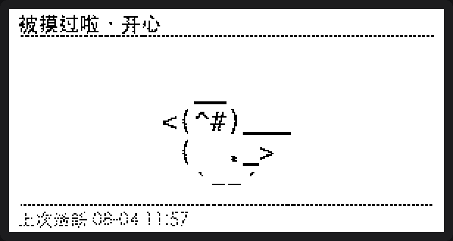
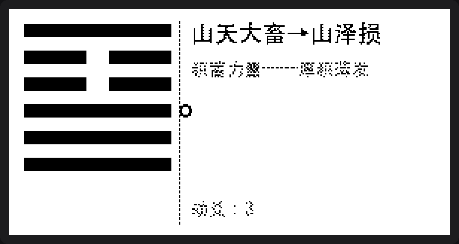
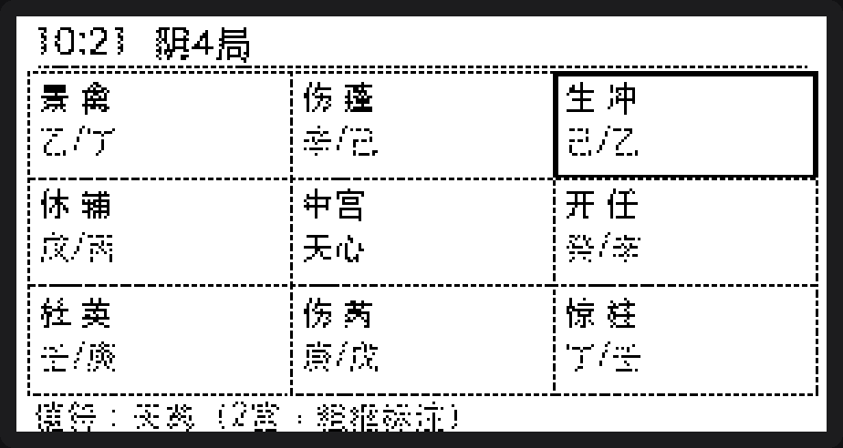
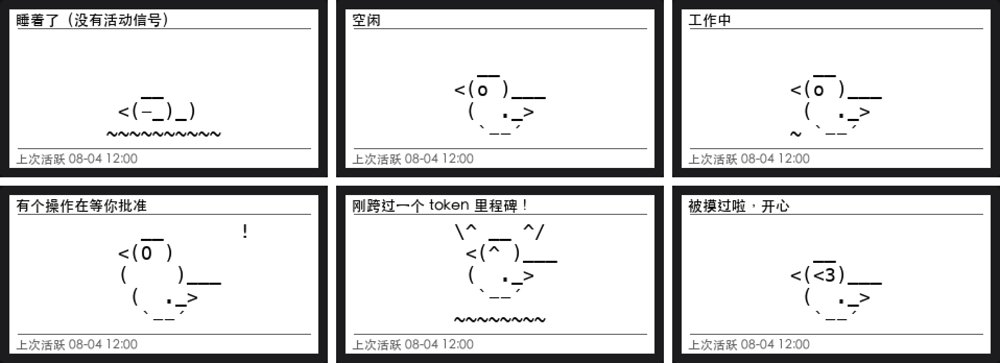
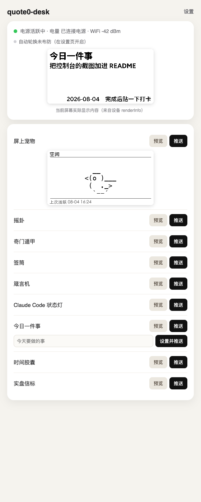

# quote0-desk

**让 [Quote/0](https://dot.mindreset.tech/developers) 墨水屏从"单向面板"变成"贴一下就会回话"的桌面装置。**

[](LICENSE)
[](requirements.txt)
[](scripts/install_launchd.sh)

一个跑在你自己电脑上的小服务，把自定义内容卡推到 Quote/0 墨水屏上，并且让屏幕能被**贴一下手机就有反应**。

跟官方社区里其他项目最大的不同：**贴一下 NFC 会闭环**。MindReset 官方生态里已经有 20+ 第三方项目（Home Assistant 集成、用量看板、MCP server……），但基本都是单向数据面板，推上去就完了。这个项目把 NFC 也用上了：贴一下手机 → 打开这张卡自己的回调地址 → 服务器执行一个动作（喂宠物、抽一签、打卡、翻下一句箴言）→ 立刻把新内容推回屏幕。屏幕出题，手机作答，屏幕再变——不只是显示器，是能被摸一下就有反应的桌面装置。

## 特性

- **NFC 真闭环**：贴一下手机，服务器执行动作，新内容立刻推回屏幕——不是"扫码看详情"，是屏幕本身会变。
- **网页控制台**：不用背命令行，打开 `http://localhost:5252` 就能看设备状态、预览/推送每张卡、开关自动轮换。
- **9 张内容卡开箱即用**：屏上宠物、六爻摇卦、奇门遁甲、签筒、桌面箴言机、今日打卡、时间胶囊、实盘信标、Claude Code 用量状态灯。
- **宠物状态对齐官方语义**：ASCII 造型和状态机移植自 Anthropic 官方 [claude-desktop-buddy](https://github.com/anthropics/claude-desktop-buddy)，接入 [buddy-bridge](#可选集成buddy-bridge) 后用真实的 Claude Code 会话信号驱动，不是瞎写的心情值。
- **开机自动拉起，隧道自愈**：`server.py` 和 NFC 公网隧道注册成 macOS 后台服务，进程死了自动重启，隧道地址变了自动回写配置，不用守着终端。
- **只用官方 REST API**：不刷机、不越权、不碰固件，Text API + Image API 两条推送路径覆盖全部卡片。

## 效果预览

<p align="center">
  
</p>

左边是宠物平时的样子，右边是手机贴一下 `/t/pet_pat` 之后立刻推回屏幕的结果——这两张图是 `render/pet.py` 本地生成的，跟真正推到设备上的是同一份图像，不是二次加工。NFC 贴一下真的能让屏幕变化这件事，在真机上的验证记录见 [`docs/DEVICE-FACTS.md`](docs/DEVICE-FACTS.md) 的 M2 一节。

<p align="center">
  
  
</p>
<p align="center">
  
  
</p>

宠物卡的六个状态都是真实语义（不是随便画的表情包）：

<p align="center">
  
</p>

## 快速开始

```bash
pip install -r requirements.txt

export DOT_API_KEY=dot_xxx...     # Dot App → More → API Key 创建
# export DOT_DEVICE_ID=xxxxxxxx   # 可选：账号下只有一台设备时会自动发现，不用填

python3 cli.py hello               # 推一张最简卡，验证链路通不通
python3 cli.py status              # 看设备在线状态
python3 cli.py snapshot out.png    # 下载当前屏幕的真实渲染图（开发期最重要的自查手段）
python3 cli.py push <card_name>    # 推 cards/ 下某张卡，比如 python3 cli.py push pet
python3 cli.py set-todo "今天要做的事"
```

**前提**：先在 Dot App「内容工坊」里加好 **文本 API** 和 **图片 API** 两个内容槽，挂到设备循环任务里。加好之后不用告诉这边具体的 key——`GET /loop/list` 会自动发现，按 `type` 字段区分。

> **槽位限制，开发新卡前先知道**：Quote/0 账号的 loop 槽位有硬上限（3 个），留 1 个给官方内容（天气/新闻）的话，实际能用的只有 2 个：**Text API** + **Image API**。这不限制卡的数量（调度器负责轮流推），限制的是"同一时刻屏幕上能露出几张脸"。完整实测记录见 [`docs/DEVICE-FACTS.md`](docs/DEVICE-FACTS.md)。

## 本地控制台

不想背命令行的话，`python3 server.py` 起来之后打开 `http://localhost:5252` 就是一个网页控制台：设备在线状态、当前屏幕实际显示的内容、每张卡的"预览"（跑一遍 `build()` 但不推送）和"推送"按钮、自动轮换的布防状态都在这一页。`/settings` 是配置页——改 NFC 回调地址、开关自动轮换、勾选参与轮换的卡，不用手改 `config.json` 或拼 `curl` 命令。

<p align="center">
  
</p>

这套 UI 是照抄 [pocket-prophet-dashboard](https://github.com/BruceLanLan/pocket-prophet-dashboard)（同作者的姊妹项目）的控制台结构做的：`templates/*.html` + 一层 `/api/*` JSON 接口，Flask 自带 Jinja2，没加新依赖。手机和这台机器同一局域网时，手机浏览器打开 `http://<这台 Mac 的局域网 IP>:5252` 也能用同一个控制台。

## 配置 NFC 交互

```bash
python3 server.py   # Flask，默认监听 0.0.0.0:5252
```

每次推送时把 `link` 字段设成自己服务的地址，手机贴一下 NFC → 打开这个 URL → 对应路由执行动作 → 立即把新内容推回屏幕。这个地址从哪来，统一由一个配置项决定：

```bash
export NFC_BASE_URL=http://192.168.1.23:5252   # 手机和这台机器在同一局域网时
```

不设置的话卡片就没有 `link`（能正常显示，只是贴了没反应）。局域网 IP 会变、或者手机和这台机器不在同一个网络时，装一个免注册的公网隧道更省心：

```bash
brew install cloudflared
cloudflared tunnel --url http://localhost:5252
# 输出里会有一行 https://xxxx.trycloudflare.com，把它设成 NFC_BASE_URL
export NFC_BASE_URL=https://xxxx.trycloudflare.com
```

`nfc_base_url` 也可以直接写进 `config.json`（已在 `.gitignore` 里，不会进仓库），不用每次开新终端都重新 `export`。

### 长期运行：开机自动拉起

上面这套手动流程有个问题——终端一关、Mac 一重启，`server.py` 和 `cloudflared` 就都没了，NFC 直接失效。`scripts/install_launchd.sh` 把两者注册成 macOS 的 LaunchAgent：开机/登录自动拉起，进程意外退出也会被 `launchctl` 自动重启；`scripts/tunnel_daemon.sh` 每次拉起新隧道都会自动解析 cloudflared 打印的新地址、写回 `config.json` 的 `nfc_base_url`，不用人工抄地址。

```bash
cp .env.example .env
# 编辑 .env，填真实的 DOT_API_KEY（.env 已在 .gitignore，不进仓库；
# 密钥不写进 launchd 的 plist，那是明文 XML）

bash scripts/install_launchd.sh   # 装两个 LaunchAgent 并立即拉起
```

安装脚本会打印日志路径；`data/tunnel_daemon.log` 里能看到当前生效的隧道地址。不想要了：

```bash
bash scripts/uninstall_launchd.sh
```

这个方案不需要注册 Cloudflare 账号，代价是隧道地址每次重启会变——但地址变了会自动写回配置，不需要人工干预，跟"固定域名的 named tunnel"（需要账号，地址永久不变）相比是有意选的权衡，见 `docs/PLAN-next-round.md`。

### NFC 路由一览

| 路由 | 触发效果 |
|---|---|
| `/t/counter_tap` | M2 验证用的计数器，贴一下 +1 |
| `/t/todo_toggle` | 今日一件事打卡，切换完成状态 |
| `/t/proverb_next` | 箴言机换下一句 |
| `/t/qiantong` | 签筒抽一签（摇卦或奇门二选一，真随机） |
| `/t/pet_pat` | 摸摸屏上宠物，触发一次性"精神"反应 |
| `/t/ping` | 探测用，只记日志不推送 |

### 排障：贴了没反应

真机踩过的坑，按可能性排序：

1. **手机开着 VPN。** 这是目前唯一确认过的"NFC 跳到 Dot App 内部预览、没转发到我们网页"的原因——App 内部会显示一个没有任何可点内容的小窗口。关掉手机侧 VPN 立刻恢复正常。花了一整晚才定位到这个，遇到同样症状可以直接跳过网络排查，先问这一句。
2. **`NFC_BASE_URL` 是旧的。** 局域网 IP 变了、隧道进程重启了地址就变了，`config.json` 里存的还是老值。重新 `export`/`config.update()` 一下。
3. **手机和这台机器不在同一局域网。** 用公网隧道方案（见上）。
4. **卡片的 `link` 是空的。** 检查对应 `cards/*.py` 的 `build()` 是不是真的用了 `config.nfc_base_url()` 拼了地址——不是所有卡都需要 NFC 交互（状态灯、时间胶囊、信标这几张本来就没有 `/t/...` 路由，`link` 为空是预期行为）。

## 全部内容卡

| 卡 | 命令 | 说明 |
|---|---|---|
| 箴言机 | `push proverb` | 种子缓存里挑一句，NFC 换下一句；不接模型生成，避免"刷一次屏调一次模型" |
| 摇卦 | `push liuyao` | `secrets` 真随机抛铜钱起卦 |
| 奇门遁甲 | `push qimen` | 九宫格排盘 |
| 签筒 | `push qiantong` | 摇卦/奇门二选一，NFC 触发版 |
| Claude Code 状态灯 | `push status` | 优先显示真实账号配额（5h/7d 用量百分比），拿不到就退回本地转录文件估算的今日 token/成本；活跃指示优先读 buddy-bridge（见下），没有就退回转录文件 mtime |
| 屏上宠物 | `push pet` | ASCII 造型和状态语义移植自官方 [anthropics/claude-desktop-buddy](https://github.com/anthropics/claude-desktop-buddy)（MIT）：sleep/idle/busy/attention/celebrate/heart，信号优先用 buddy-bridge 的实时 running/waiting，没有就退回扫 commit 时间；NFC 贴一下 = 摸摸（heart）；`waiting` 持续超过 5 分钟会从"有个操作在等你批准"升级成点名具体工具（需要 buddy-bridge） |
| 今日一件事 | `push todo` / `set-todo "..."` | 单条每日承诺，NFC 打卡 |
| 时间胶囊 | `push capsule` | 本机 git 仓库历史里"一年前/一个月前/一周前的今天"提交 |
| 实盘信标 | `push beacon` | 只读展示交易策略持仓 + 选股信号，不导入对应项目的代码/密钥 |

新加一张卡该怎么接，见 [`docs/ADDING-A-CARD.md`](docs/ADDING-A-CARD.md)。日课/时辰盘（干支排盘卡）计划中但尚未实现。

### 可选集成：buddy-bridge

如果本机在跑 [buddy-bridge](https://github.com/anthropics/claude-desktop-buddy)
风格的 hook 桥接守护进程（`~/buddy-bridge`，`GET http://127.0.0.1:49431/status`
带 `~/.buddy-bridge/token` 鉴权），状态灯和屏上宠物会自动优先用它的实时
`running`/`waiting` 信号，比"猜"（扫转录文件 mtime、扫 git commit 时间）
准得多——宠物甚至会多一个"有操作在等你批准"的表情。**这是可选的**，没有
这个守护进程两张卡照样正常工作，只是退回原来的猜测逻辑，见
`providers/buddy.py` 的降级处理。

## 项目结构

```
quote0-desk/
  dot.py            # 官方 REST API 薄客户端：devices/status/settings/text/image/canvas
  config.py         # 配置读写；API Key 只认环境变量，绝不落 config.json
  cards/            # 内容源：build() → {"data", ...} 走 Text API，或 {"png", ...} 走 Image API
  canvas/            # 文本卡的数据形状（title/message/footer 三段式，喂给 Text API）
  render/            # 需要逐像素控制的卡（爻线、九宫格、ASCII 宠物）本地 PIL 渲染
  providers/         # 纯数据逻辑，不碰渲染/推送
  server.py          # Flask：NFC 回调 /t/<action>
  push.py            # cli.py 和 server.py 共用的"按卡名推送"逻辑
  scheduler.py        # 后台线程，按周期轮换推送
```

所有卡分时复用 2 个槽（Text + Image），由 `scheduler.py` 决定当前该显示哪张。设备原生的自动轮转（`interval.powerMs`）调到了官方上限（12 小时）避免它在没推送的间隙自己把画面转走——这是刻意的取舍：曾经考虑过反过来利用原生轮转做"双通道并行"，但设备是三个槽（文字/图片/官方内容）一起轮，会打断 NFC 交互"贴一下之后结果要稳稳停在屏幕上"这个核心体验，所以否决了，细节见 `docs/DEVICE-FACTS.md`。

## 自动轮换

```bash
python3 cli.py auto-cards proverb status todo capsule beacon liuyao qimen pet
python3 cli.py arm            # 打开自动轮换
python3 cli.py disarm         # 关闭
python3 server.py             # 常驻运行，调度线程随 Flask 一起启动
```

默认关闭，需要显式布防。命令行是最快的一次性设置方式；常用的话更推荐用[本地控制台](#本地控制台)的设置页点选，或者直接打 `GET/POST /api/config` 查看或改配置（`auto_push_enabled` / `auto_push_interval_minutes` / `auto_push_cards` / `nfc_base_url`）。

## 自己部署：需要改的几处

`providers/beacon.py`、`capsule.py`、`pet.py` 里有几个路径常量，指向我本机的项目位置：

```python
# providers/beacon.py
LIGHTER_SCALPER_DIR = os.path.expanduser("~/lighter-scalper")
STOCK_RADAR_DIR = os.path.expanduser("~/dev/stock-radar")

# providers/capsule.py, providers/pet.py
DEFAULT_REPOS = [os.path.expanduser("~/dev/quote0-desk"),
                 os.path.expanduser("~/dev/pocket-prophet-dashboard")]
```

这几个目录在别人机器上大概率不存在——不是 bug，是"配置成你自己的路径"这一步，代码本身会优雅降级（读不到就显示"暂无数据"，不会报错崩溃），把这几个常量改成你自己的实际路径就能让这几张卡显示有意义的内容。

## 开发状态

M0（真机契约验证）到 M6（调度器 + 隐私审查）已完成，NFC 反馈闭环（项目的核心假设）已真机验证通过，完整记录见 [`docs/DEVICE-FACTS.md`](docs/DEVICE-FACTS.md)。下一轮规划见 [`docs/PLAN-next-round.md`](docs/PLAN-next-round.md)。

## License

[MIT](LICENSE)
